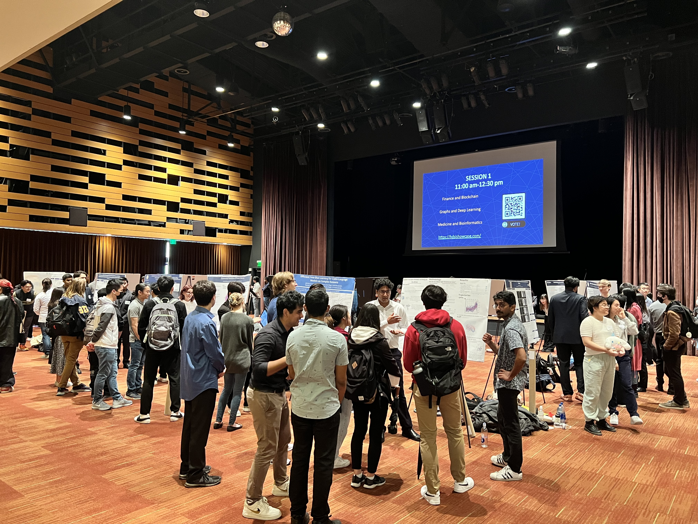
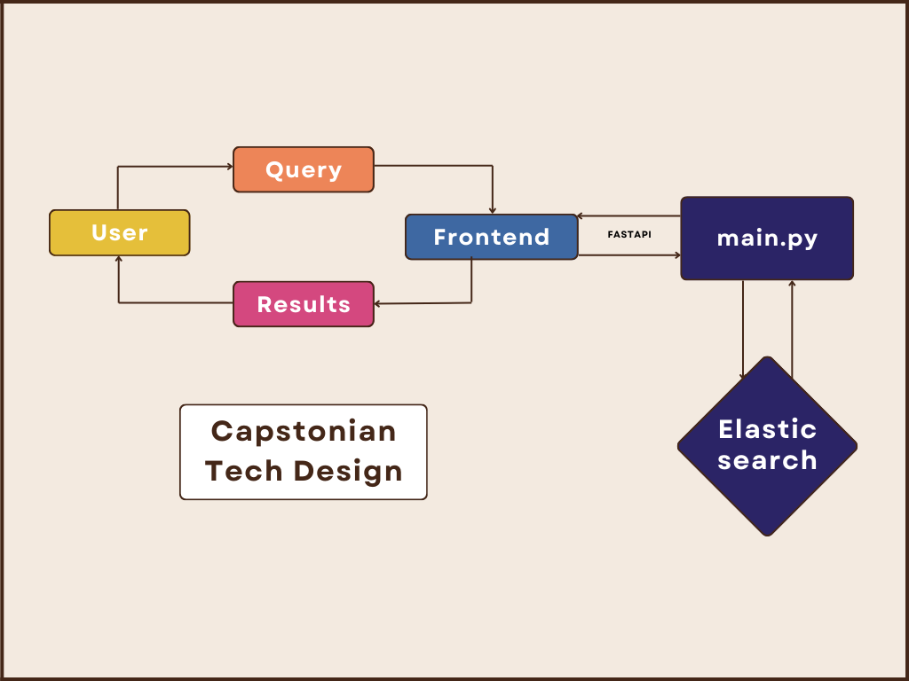
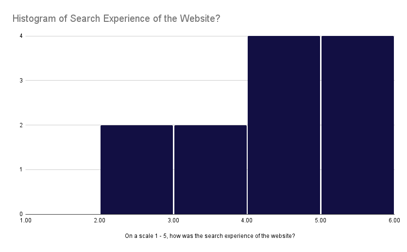
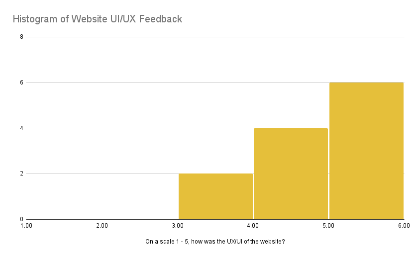
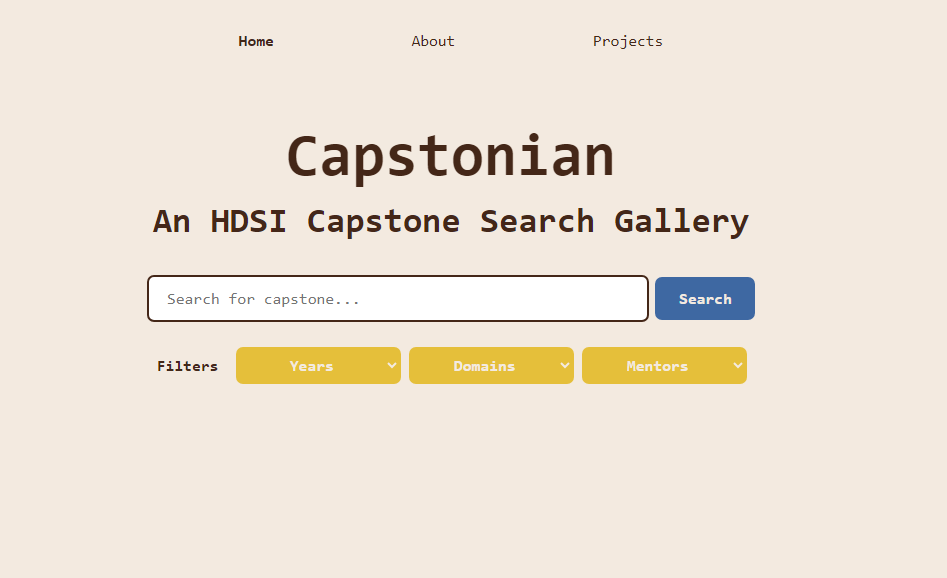
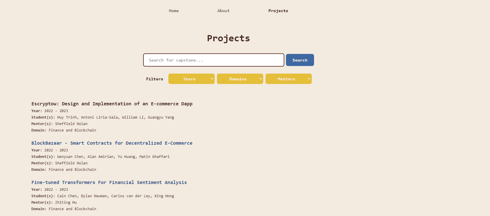
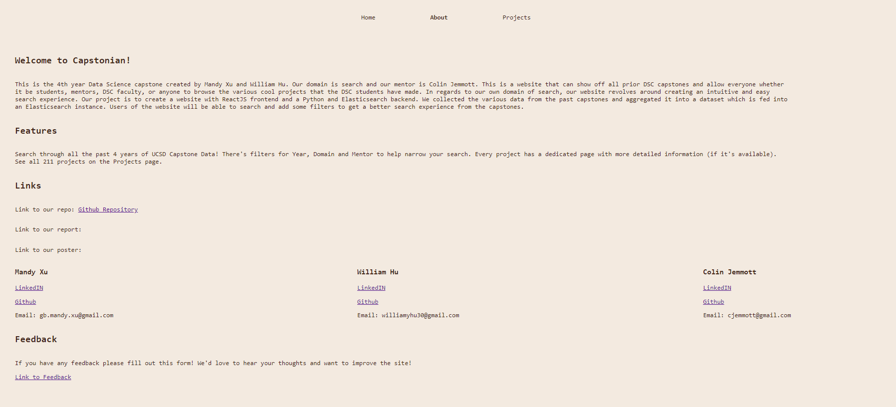
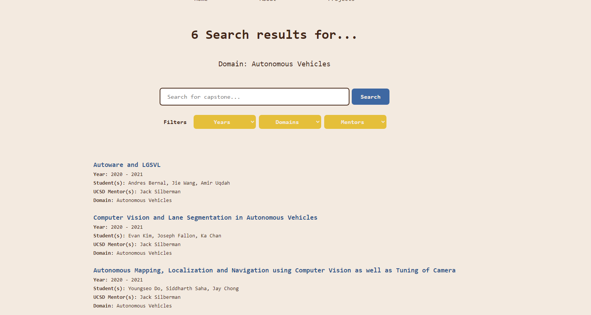
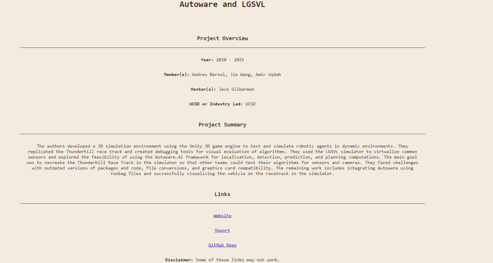

# Capstonian: An HDSI Capstone Search Gallery
### By: William Hu, Mandy Xu

## Introduction
The UC San Diego Halıcıoğlu Data Science Institute (HDSI) is a fairly recent department where students learn the foundations of data science through a complete curriculum. One aspect of this program is the senior capstone sequence that students participate in their last year in which faculty and industry mentors guide students in a quarter-long project that is then showcased to members of the data science department at the end of the quarter. However, while the annual capstone showcase is a great way to celebrate the graduating class and their hard efforts, there is no easy or accessible way to display their work past the showcase. Currently, student capstone projects are presented in a list-type format on a website that is pretty much only available for current capstone students. 

*While the in-person capstone is great, it only lasts for one day. What we have (can be) is permanent*

The absence of a search tool for these projects makes it difficult for users, particularly faculty and current students, to efficiently navigate through various projects based on their desired parameters. That is why through this project, we hope to provide a more visible gallery to showcase these projects through ease of navigation that also serves as an efficient way to discover new projects. To do so, we have implemented a search engine that takes in a string query and/or preset filters and returns relevant projects using keyword and semantic search techniques. We package our search engine with a user-friendly interface in order to deliver a full stack website that streamlines the exploration of capstone projects. With our approach, we aim to improve the navigation of capstone projects, enhancing the overall user experience!

## Data
We sourced our data from the [official Data Science capstone website](https://dsc-capstone.org/archive/), which organizes the raw data by each capstone year. At the time of this project, there are four capstone years available spanning from 2019 to 2023. Given the relatively recent establishment of the UCSD Data Science program, there seemed to be additional components to consider. For example, the year 2020-2021 introduced a written report and the year 2022-2023 introduced the poster requirement. As a result our data scraping process could not be unified into one script. Instead, each year had to be individually processed to create a consolidated data structure. 

Across all years, we set out to obtain these relevant features for each project by using BeautifulSoup (a Python library for parsing data): year, domain, project title, students involved, mentors and companies involved, GitHub repository URL, website URL, report URL, and poster URL. We extracted each project group's GitHub contributor profiles, the language breakdown of the repository, and the README file using [GitHub's REST API](https://docs.github.com/en/rest?apiVersion=2022-11-28). Additionally, to extract the contents of each project's report, we used the Python package PyPDF2 to extract the text and images of each report as well as gdown to do the same from Google Drive as some reports were stored there. Finally, using the report contents data and stored README contents, we included an additional feature by transforming the report and README contents into their respective summaries using a mix of [OpenAI's GPT-3.5 and GPT-4 API](https://platform.openai.com/docs/guides/text-generation/chat-completions-api) and feeding it the query "Summarize this: \{text contents\}". Few projects didn't have a report. In this case, we returned "Report summary unavailable". As mentioned earlier, we were unable to extract all of this data for every project due to the evolving project requirements for each year.

Once we extracted all of the required data, we created a combined dataframe that contained all the information mentioned above as well as a more organized database-like system with six separate dataframes:

1. An overview of the project that included the project's ID, year, domain, and project title.
2. Every student to have participated in the Data Science capstone, as identified by their project ID.
3. Every mentor, industry partner, and available specific industry mentors to have participated in the Data Science capstone, as identified by their project ID.
4. Links to each group's GitHub page, report, website, and code if available, as identified by their project ID.
5. A group's GitHub data if it was available, as identified by their project ID. Specifically the repository URL, contributors' usernames and link to their profiles, the repository's programming language breakdown, and the raw and summarized contents of the README file.
6. A group's report data if it was available, as identified by their project ID. Specifically, the report URL, and the raw and summarized contents of the report.

## Methods
After processing our data into an organized and readable format, we began implementing our search tool. To do so, we employed [ElasticSearch](https://www.elastic.co/guide/en/elasticsearch/reference/current/index.html), a distributed search and analytics engine designed for scalability and speed. At the same time, we applied [React](https://react.dev/), a JavaScript library for building user interfaces. To connect the two endpoints, we used [FastAPI](https://fastapi.tiangolo.com/), a web framework for building APIs with Python.

### ElasticSearch
Our ElasticSearch ingested traditional keyword matching as well as semantic search elements. 

For the keyword matching portion, ElasticSearch has its own built-in [BM25 algorithm](https://en.wikipedia.org/wiki/Okapi_BM25#:~:text=BM25%20is%20a%20bag%2Dof,slightly%20different%20components%20and%20parameters.) which is a ranking function used in information retrieval to score the relevance of documents to a given search query. We applied this to both the query as a phrase and the individual words (tokens) within the query. On top of that, we boosted the specific fields: year, domain, student names, and mentor names. We wanted to make sure these fields within the query were prioritized in the top results.

For the semantic search portion, we encoded the project titles, and summarizations of the READMEs and reports with [SBERT](https://www.sbert.net/) (Sentence-BERT), which is a variant of the popular [BERT](https://en.wikipedia.org/wiki/BERT_(language_model)) (Bidirectional Encoder Representations from Transformers) model, a natural language processing (NLP) model developed by Google to capture bidirectional contextual information from text. SBERT is built on BERT and is finetuned specifically for sentence embeddings. The query is then encoded into the same embedding space as the document encodings mentioned above. To evaluate which results to return to the user, we use cosine similarity which measures the similarity between two vectors (in this case, the query and the encoded documents).

In addition to users being able to query for results, we also provide the ability to filter the capstone year, domain, and/or mentor. This method allows for only the desired filters to be returned. For example, if the user is interested in only the capstones from 2022-2023, they can filter for that and only get those 66 projects.

#### Search Evaluation
To evaluate our search engine, we employed normalized discounted cumulative gain (NDCG) which is an evaluation metric that takes into account both the relevance of items and their positions in the list. We evaluated results based on the following criteria:
* 0 = totally irrelevant
* 1 = weak match
* 2 = strong match
* 3 = exact match
  
Using a mixture of 15 query/filter combinations, our final search engine obtained an NDCG score of 0.98.

### React.js
Our goal for a friendly user experience is to provide a clean, simple, and easy to navigate user interface. Since the main feature of our website is the search function, emphasizing the search tool was crucial.

For every result deemed most relevant to the user's query, we offer a concise, at-a-glance overview of a project's details: the project name, year, students involved, UCSD or industry mentors involved, and domain. Each project synthesis is redirected to the their respective pages that present more detailed information (e.g. project summary) upon a user's click.

For every individual project, we display the same information as the search results page (project title, year, students, and mentors) as well as a project summary (extracted from the report using OpenAI from earlier) and URLs to each group's GitHub page, report, website, and poster (if available). In addition to this, we include the GitHub repository's README information, language breakdown of the GitHub repository and the GitHub contributors along with links to their personal profiles.

#### Result Evaluation
Aside from our own internal tuning of the search engine, we created a feedback form and asked our peers to give feedback, specifically on the website user experience and search experience. We asked how each experience was on a scale of 1 (confusing) to 5 (intuitive and easy to use). Below are our visualized results:

*Feedback on search experience*

*Feedback on user experience*

From the figures, we can see feedback on both experiences skew positive. One thing to note is that we asked for feedback before certain features were completed which may account for lower ratings. However, we do acknowledge that our website has room for improvement which is discussed more in the Next Steps section.

### FastAPI
We used FastAPI to implement our backend system for our search engine application and connect our endpoints. The backend interacts with an ElasticSearch server to handle search queries and filter results based on specified criteria. The integration of FastAPI and Elasticsearch enables seamless communication between the backend and frontend components.

### MS Azure
We used MS Azure to host [our website](http://capstonian.eastus.cloudapp.azure.com:3000/) 
(this may go down after we run out of credits). We spun up a virtual machine and redeployed our repository on there and opened the network connections so everyone can access it.

## Results
Our final website has three pages (pictured below): the home page with the main search tool, an about page, and an all projects page (to browse when the user has no specific query in mind). 

*Home Page*

*Project Page*

*About Page*

Finally, here is an example filter of "Autonomous vehicles" with its results:

*SearchResults Page*

*ProjectDetails Page*

## Conclusion
Our project was aimed to address the lack of an efficient and accessible way to explore previous capstone projects. The existing HTML format posed difficulties for faculty and data science students in navigating through the extensive collection of projects. Therefore, we created a search tool to be able to easily navigate and explore these projects. By developing a user-friendly search tool, we aimed to streamline the exploration process and enhance the visibility of these projects beyond the annual showcase.

### Next Steps
There remain several avenues for future exploration and development in this area. Some of the points below include reach goals we did not have the time for as well as user feedback.

* Finetune Elasticsearch further to improve on student name hits. Currently, our search engine is accurate in returning queries including one student name but not accurate in returning more than one student name (even if the student names are in the same project group). 
* Query autocomplete: Being able to predict what the user is typing to help them narrow down their search and save time. 
* Suggested topics to explore on the home page. This is especially useful for non-DSC majors or those unfamiliar with the HDSI senior capstones. 
* Include images to individual project pages. Extracting report images to include on project pages and rotate through them. This helps separate the text heavy data that we obtained. 
* Multiple filters within the same category. For example, being able to filter 2021-2022 and 2022-2023 as opposed to only 2021-2022. Currently, our implementation only supports the latter. 
* Dynamic filtering: As the user chooses their desired filters, remove incompatible filters to avoid not being able to return certain results. For example, if the user chooses to filter the mentor "Colin Jemmott", remove the years (all years but 2020-2021) and domains (all domains but "Recommender systems") that "Colin Jemmott" did not mentor.
* Clean up the domain filter by broadening the scope of topics. A lot of domains are similar in nature due to the evolving domain names throughout the years. For example, aggregating "graph neural networks" and "Graphs and Deep Learning". 
* Displaying the "best" projects. During the capstone showcase typically held at the end of winter quarter (March), attendees are able to vote on their favorite projects. Being able to display this is an additional way to showcase projects and enhance project exploration. 

### Shoutouts
We would like to thank our mentor Colin Jemmott, Suraj Rampure and the 180B staff, and our peers for the endless support!
